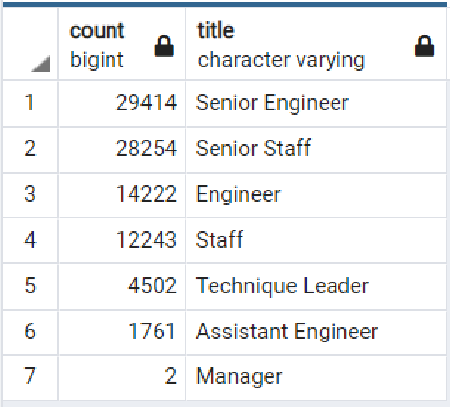
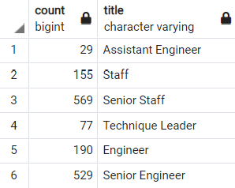
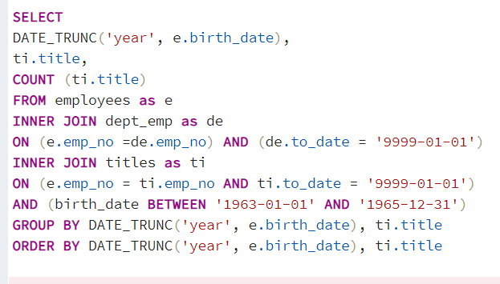
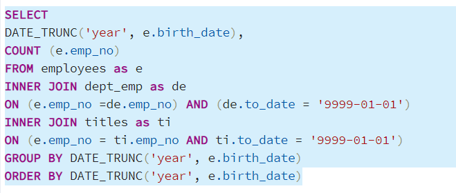

# Pewlett-Hackard Analysis

## Overview

Pewlitt Hackard is a large company with many older employees that may soon be retiring. In preparation for the “silver tsunami” as many current employees leave we will be:
- Determing the number of retiring employees per title.This will be done by creating a "Retirement Titles" table that holds all the titles of current employees who were born between January 1, 1952 and December 31, 1955
 
- Identifying employees who are eligible to participate in a mentorship program, that will help with ramping up replacements skill sets. This will be done by creating a "mentorship-eligibility" table that holds the current employees who were born between January 1, 1965 and December 31, 1965.

We will utilise the Entity Relationship Diagram already created from csv data files given.

## Resorces

Postgres SQL 12.5, Quick DBD (https://www.quickdatabasediagrams.com/)

## Results

We can see by looking at the employess retiring by title:
 - The Engineering department will be hit hard ~45K engineers potentially retiring.
 - Pewlitt-Hackard will mostly lose Senior Engineers 29,414
 - The retirees will be mostly made of Senior personel. For both Engineers and staff  we see 2 to 1 ratio of seniors leaving.  
 - There are not many managers approaching retirement. 
 

 The mentorship eligibility table gives us further information. here I have used group by title and count to see:

 - We only have 1549 staff that meet current criteria.
 - The highest eligibility is with senior staff at 569.
 - There are only 529 senior engineers.
 - There are  a total of 748 possible mentors in the engineering department.
 ## Summary

 -  Pewlitt-Hackard have 90,398 positions in total that will need to be filled  as the "silver tsunami" begins to make an impact. Half of these positions are engineers, a third are senior engineers.

- We are looking to see if there are enough qualified, retirement-ready employees in the departments to mentor the next generation of Pewlett Hackard employees. The current criteria gives us 1549 mentors, 748 in the engineering department. This is a 1 to 60 ratio of mentors to new hirees in engineering. 

## Suggestions

- I would suggest expanding the criteria for mentors to include a broader age range. If we look at employs born slightly earlier, we find earlir years have larger groups.

    - The following query will show us the titles of staff born 1963 to 1965.

    [mentors_by_year.png](Queries/mentors_by_year.png)

- Changing the between dates allows us to get an overview of each years staff number by title.
On running this query we can see the titles seem to remain fairly proportional for neigboring years.

    -  With this in mind we can get a big picture over of staff with the following query that counts staff by birth year. 
[Queries/Employees_by_birth_year.sql](Queries/Employees_by_birth_year.sql)

- Upon running this query we will see we have around ~18k employees born in each year between '60 and '64.

